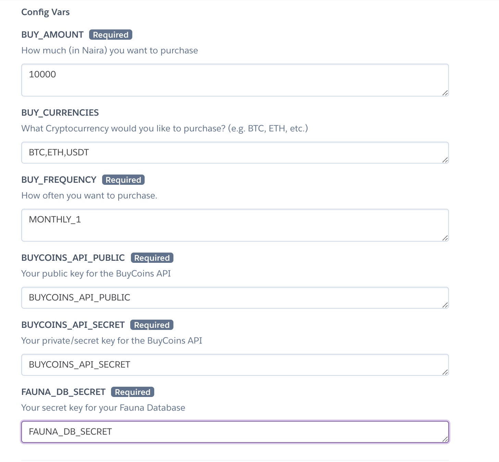

# BuyCoins Recurring Buy

This is an open-source project which you can use to spread your investment in Cryptocurrencies over a period of time. Make automated purchases of any Cryptocurrency daily, weekly, or monthly!

[Dollar cost averaging (DCA)](https://en.wikipedia.org/wiki/Dollar_cost_averaging) is an investment strategy that aims to reduce the impact of volatility on large purchases of financial assets such as equities. By dividing the total sum to be invested in the market (e.g., ₦100,000) into equal amounts put into the market at regular intervals (e.g., ₦1,000 per week over 100 weeks), DCA seeks to reduce the risk of incurring a substantial loss resulting from investing the entire lump sum just before a fall in the market.

## What you'll need

- A [BuyCoins](https://buycoins.africa/) account, with access to the API (see below)
- A [Heroku](https://heroku.com/) account
- A [Fauna DB](https://fauna.com/) account
- Basic knwoledge of how to use these tools

## Setup

### 1. Get access to the BuyCoins API

You'll need access to the [BuyCoins API](http://developers.buycoins.africa/) in order to make automatic purchases. To apply for access, send an email to support@buycoins.africa with the email address attached to your BuyCoins and a link to this project.

Once you have access, go to your [API Settings](https://buycoins.africa/settings/api) page. Generate and copy your public and secret keys. These keys will be used as the `BUYCOINS_API_PUBLIC` and `BUYCOINS_API_SECRET` environment variables on Heroku.

### 2. Create a Fauna database

Sign up for an account with [Fauna DB](https://fauna.com/) and create a database (you can name it anything you want).

Under your database security settings, create a new Key with the **admin** role and copy your generated secret key. This key will be used as the `FAUNA_DB_SECRET` environment variable on Heroku.

### 3. Decide on your daily/weekly/monthly spend

Next, you'll need to specify how often you want to buy coins, how much you want to spend on each purchase, and the cryptocurrency pair you want to purchase. You do this by setting the following environment variables:

1. `BUY_FREQUENCY`
    - `DAILY` - if you want to buy every day
    - **WEEKLY_[1-7]** - if you want to buy once a week. e.g. `WEEKLY_1` to buy every Monday
    - **MONTHLY_[1-29]** - if you want to buy once a month. e.g. `MONTHLY_5` to buy on the 5th day of each month
2. `BUY_AMOUNT`
The amount (in Naira) you want to purchase at each frequency.
3. `BUY_CURRENCIES`
The currency pair you want to trade. e.g. `btc_ngnt` to buy btc with ngnt. To see all the cryptocurrency pairs supported by Buycoins, you can use the [getPairs](https://developers.buycoins.africa/orderbook-trading/glossary) method.

### 4. Deploy to Heroku and add environment variables

When deploying, you'll need to add the environment variables from the previous steps to your new app.

### 5. Setup Heroku Scheduler

Finally, go to your Heroku project "Resources" tab and click the Heroku Scheduler Add-on.

Next, create a new job using the following settings:

- Schedule: `Every day at..` (any time of your choosing)
- Run Command: `recurringBuy`

Note: Make sure the job is set to run every day, regardless of your `BUY_FREQUENCY`.

### 6. (Optional) Get updates

If you want to get updates on this project as we continue to improve it, you'll need to create a fork of this repository to your Github account. 

Once you've done that, setup deployments to your Heroku application from your forked project. 
